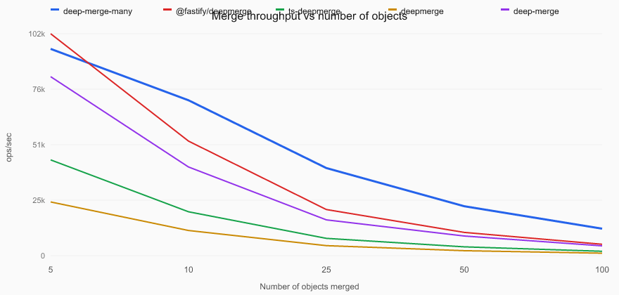
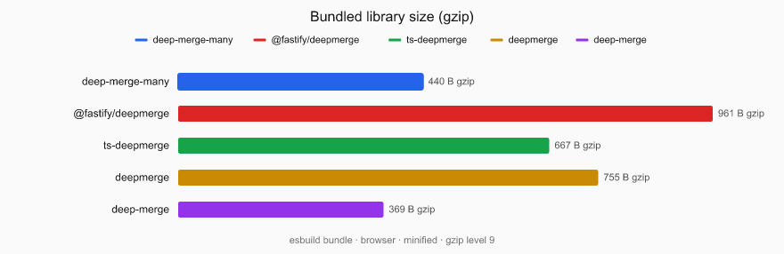

# deep-merge-many

[](https://github.com/Latnac/deep-merge-many/actions/workflows/ci.yml)
[](https://www.npmjs.com/package/deep-merge-many)
[](LICENSE)

Deep-merge **many** plain objects in one call. Recurses into nested objects; combines numeric leaves with `Math.max`, except keys named `min` which use `Math.min`.

Optimized for merging large batches (10+ objects) in a single pass — see [benchmarks](#benchmarks).

## Why this exists

**deep-merge-many** started as in-app merge logic for a product that filters search results by **per-user, per-item eligibility** on our side. We could not express that in a single Algolia query, so we ran **many searches in parallel** (different filter sets / curated collections), applied eligibility to the hits, and then had to present **one** facet panel for the combined result set.

Each [Algolia search response](https://github.com/algolia/algoliasearch-client-javascript/blob/b9d89e9913a38f857514c66f8cc184240113bbcb/packages/algoliasearch/lite/model/baseSearchResponse.ts) includes:

- **`facets`** — facet value counts (`{ [facetName]: { [value]: number } }`)
- **`facets_stats`** — min / max (and related stats) for numeric facets (`{ [facetName]: FacetStats }`)

After merging hits from several responses, the UI still needs a **union** of that metadata across every query that contributed results:

| Field | Goal when combining responses |
| --- | --- |
| `facets` | For each facet value, keep the **highest** count seen in any response (a value visible in any query should count). |
| `facets_stats` | Widen numeric ranges: **max** of each `max`, **min** of each `min` (and the same max rule for other numeric stat fields). |

`deepMerge` encodes exactly that: numeric leaves use `Math.max`, except keys named `min` which use `Math.min`. Nested objects (facet names, then values or stat keys) are merged recursively. The helper was extracted into this small, dependency-free package so the same semantics are reusable anywhere you merge many plain objects at scale—not only Algolia.


## Behavior

- **Nested plain objects** are merged recursively (arrays and other types are leaves).
- **Numeric leaves** use `Math.max` by default.
- Keys named **`min`** use `Math.min` instead.
- Empty entries, `undefined`, and `{}` are skipped when collecting keys.

## Install

```bash
npm install deep-merge-many
```

## Usage

```ts
import { deepMerge } from "deep-merge-many";

const merged = deepMerge([
  { bounds: { price: { min: 10, max: 100 } }, counts: { a: 3, b: 1 } },
  { bounds: { price: { min: 5, max: 200 } }, counts: { a: 1, b: 5 } },
  // …more pages or chunks
]);
// {
//   bounds: { price: { min: 5, max: 200 } },
//   counts: { a: 3, b: 5 },
// }
```

### Algolia `facets` and `facets_stats`

After parallel queries, merge the facet metadata from each response (omit `undefined` / empty objects if a query returned no facets):

```ts
import { deepMerge } from "deep-merge-many";
import type { BaseSearchResponse } from "algoliasearch/lite";

const responses: BaseSearchResponse[] = /* parallel search results */;

const facets = deepMerge(
  responses.map((r) => r.facets).filter(Boolean),
) as NonNullable<BaseSearchResponse["facets"]>;

const facets_stats = deepMerge(
  responses.map((r) => r.facets_stats).filter(Boolean),
) as NonNullable<BaseSearchResponse["facets_stats"]>;
```

Example: two responses for the same `brand` facet — counts take the max per value; stats widen min/max across queries:

```ts
deepMerge([
  { brand: { Nike: 10, Adidas: 3 }, price: { min: 20, max: 100, avg: 50 } },
  { brand: { Nike: 4, Puma: 7 }, price: { min: 5, max: 200, avg: 80 } },
]);
// {
//   brand: { Nike: 10, Adidas: 3, Puma: 7 },
//   price: { min: 5, max: 200, avg: 80 },
// }
```

The export is `deepMerge` — one function, any number of input objects.

## Development

Requires [pnpm](https://pnpm.io/) 11+ and Node 18+.

```bash
pnpm install
pnpm test
pnpm run build
```

See [CONTRIBUTING.md](CONTRIBUTING.md) for pull requests and [PUBLISHING.md](PUBLISHING.md) for npm releases.

## Benchmarks

Multi-object merge throughput (5 → 100 nested objects) vs [@fastify/deepmerge](https://github.com/fastify/deepmerge), [ts-deepmerge](https://www.npmjs.com/package/ts-deepmerge), [deepmerge](https://www.npmjs.com/package/deepmerge), and [deep-merge](https://www.npmjs.com/package/deep-merge).

**deep-merge-many** leads from ~10 objects upward on identical payloads. Other libraries use different merge rules — this measures throughput, not identical output.



Bundle weight (each library’s merge entry point, esbuild-bundled for the browser, minified, gzip level 9):



```bash
pnpm bench
open benchmark/chart.html
```

Regenerates `benchmark/chart.html`, `docs/benchmark.svg`, `docs/benchmark.png`, and `docs/benchmark-size.svg` / `.png`.

## License

MIT
