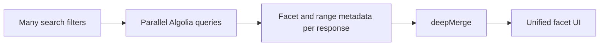

# deep-merge-many

[](https://github.com/Latnac/deep-merge-many/actions/workflows/ci.yml)
[](https://www.npmjs.com/package/deep-merge-many)
[](LICENSE)

Deep-merge **many** plain objects in one call. Recurses into nested objects; combines numeric leaves with `Math.max`, except keys named `min` which use `Math.min`.

Optimized for merging large batches (10+ objects) in a single pass — see [benchmarks](#benchmarks).

## Why this exists

**deep-merge-many** started as in-app merge logic for a product that runs many parallel **Algolia** searches (one filter set per curated collection) and then combines facet and range metadata from every response.

When several queries return overlapping facet buckets or numeric bounds, the UI needs a single object: counts should reflect the **union** of what any query saw (numeric leaves use `Math.max`; keys named `min` use `Math.min`). That pattern was extracted into this small, dependency-free library so the same semantics are reusable anywhere you merge many plain objects at scale.



## Behavior

- **Nested plain objects** are merged recursively (arrays and other types are leaves).
- **Numeric leaves** use `Math.max` by default.
- Keys named **`min`** use `Math.min` instead.
- Empty entries, `undefined`, and `{}` are skipped when collecting keys.

## Install

```bash
npm install deep-merge-many
```

## Usage

```ts
import { deepMerge } from "deep-merge-many";

const merged = deepMerge([
  { bounds: { price: { min: 10, max: 100 } }, counts: { a: 3, b: 1 } },
  { bounds: { price: { min: 5, max: 200 } }, counts: { a: 1, b: 5 } },
  // …more pages or chunks
]);
// {
//   bounds: { price: { min: 5, max: 200 } },
//   counts: { a: 3, b: 5 },
// }
```

### Algolia facet / range merge

After parallel Algolia queries, merge per-response facet counts into one object for the UI:

```ts
import { deepMerge } from "deep-merge-many";

const filterFacet = deepMerge(
  responses.map((r) => r.filterFacet),
) as Record<string, Record<string, number>>;

const filterRange = deepMerge(
  responses.map((r) => r.filterRange),
) as Record<string, Record<string, number>>;
```

The export is `deepMerge` — one function, any number of input objects.

## Development

Requires [pnpm](https://pnpm.io/) 11+ and Node 18+.

```bash
pnpm install
pnpm test
pnpm run build
```

See [CONTRIBUTING.md](CONTRIBUTING.md) for pull requests and [PUBLISHING.md](PUBLISHING.md) for npm releases.

## Benchmarks

Multi-object merge throughput (5 → 100 nested objects) vs [@fastify/deepmerge](https://github.com/fastify/deepmerge), [ts-deepmerge](https://www.npmjs.com/package/ts-deepmerge), [deepmerge](https://www.npmjs.com/package/deepmerge), and [deep-merge](https://www.npmjs.com/package/deep-merge).

**deep-merge-many** leads from ~10 objects upward on identical payloads. Other libraries use different merge rules — this measures throughput, not identical output.


Bundle weight (each library’s merge entry point, esbuild-bundled for the browser, minified, gzip level 9):


```bash
pnpm bench
open benchmark/chart.html
```

Regenerates `benchmark/chart.html`, `docs/benchmark.svg`, `docs/benchmark.png`, and `docs/benchmark-size.svg` / `.png`.

## License

MIT
